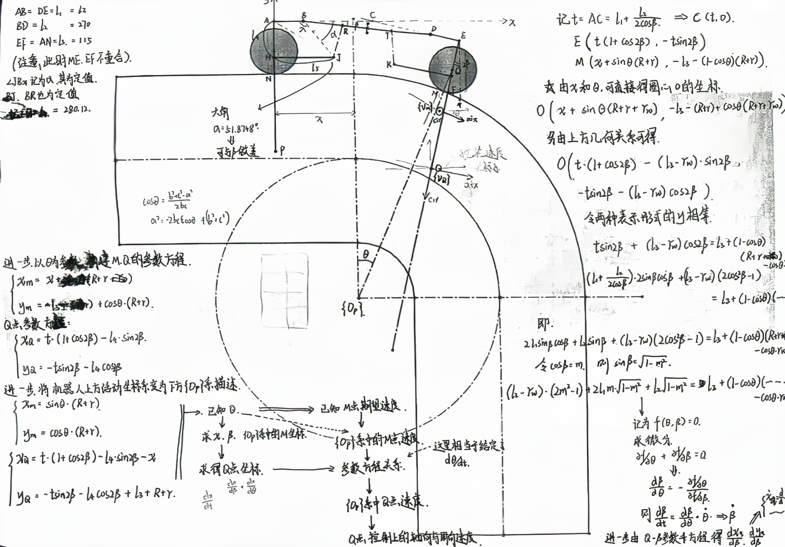
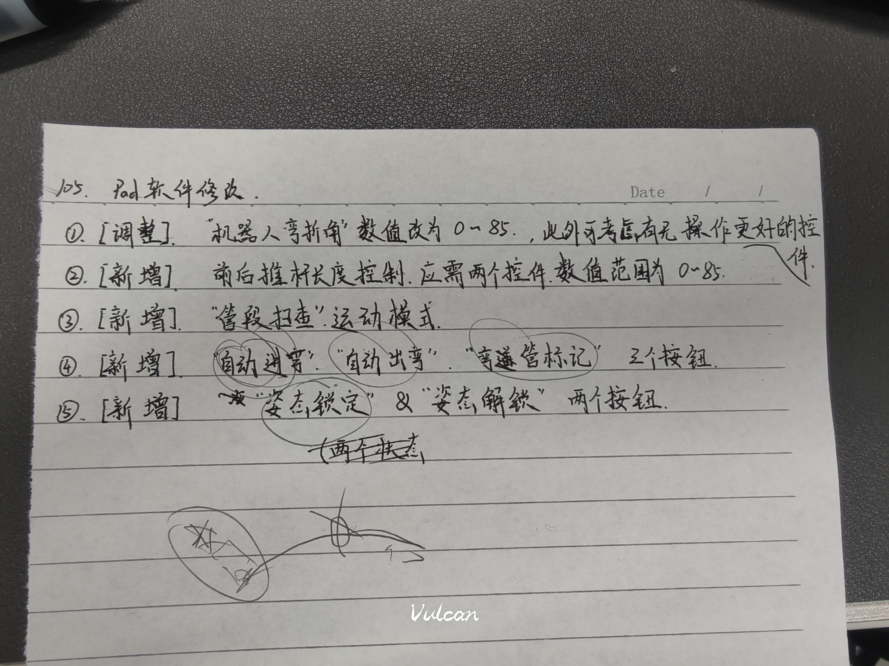

# 管道机器人

移植于原版的TCP通信架构的工程，readme中主要记录开发过程中遇到的问题以及开发日程

## 开发日程

### 2025.3.14

- 完成初版工程工作空间的搭建
- 移植了 `VINS-RGBD`以及 `realsense-ros`的工程
- 初步调整完善了TCP通信与手柄APP通信的 `tcp_server_node`部分模块

### 2025.3.28

- 测通与单片机的通讯
- 调整优化了recv函数中出现的字符中断不完整的问题

## 2025.3.29

- 调整规范了节点之间的消息信道
- 删除了之前定义的一些冗余消息类型
- 将后续的python收发数据节点拆分为多个可执行程序

## 2025.3.30

- 规范了所有要用到的节点通讯格式，将底层与32交互的python文件拆分为一个独立的 `single_side`类，使得底层代码简洁
- 整理清晰了消息信道定义，目前已经将所有来自于手柄的信息、32回传的信息以及控制32的接口汇聚在了主类 `MAIN_ROBOT`中
- 目前还差舵轮运动学求解、以及对机器人后续的状态机逻辑编写（需要阅读一下东电的舵轮复位操作部分的逻辑）
- **注**：已经用板子测通了32端消息的发布，打开 `single_side.py`中主函数的注释即可检验功能。

## 2025.04.15

- 初步完成了上位机状态机控制设计
- 完成了现有手柄的控制信息转义
- 待测试可用性

## 2025.05.08

- 初步完成了推杆控制的python文件与cpp文件编写，目前只差与手柄之间的type对齐
- 后续使用时在 `MAIN_ROBOT::motion_cmd_callback`函数中添加新的链接type即可

## 2025.05.27

- 加入了IMU模块的数据读取，并在主程序中添加了相关接收sub
- 卡在了IMU体坐标系轴向机器人坐标系轴转换的坐标变换求解地方，需要补一下机器人学的知识

## 2025.05.29

- 处理好了之前的坐标系问题，采用了四元数来描述夹紧后续的姿态变化过程，从而求解误差角度
- 引入了PID控制器，并做了基本检验，可以进行单侧姿态闭环PID测试了

## 2025.06.06

- 新增了基于舵轮里程的轮式里程计
- 在主程序中完成了结合前后侧夹紧状态的里程计数据自动生成
- *还没有测试是否有效*

## 2025.06.19

- 标定了轮式里程计的缩放因子
- 与现有软件联调，调通了步进与扫查功能
- 测试了在步进模式下轮式里程计的实际运动精度，结果发现在 `single_side`的节点中接收时的数据本身存在跳变，也即收到的数据是在厘米级的跳动，感觉32端的数据不是很实时

## 2025.07.03

- 优化完成了机器人机身弯折角的控制，完成了基于机械模型向推杆长度值的转换

## 22025.08.08

- 开始计划引入基于机器人几何非线性约束的自动过弯规划

> 机器人的几何模型如下规定：
>
> 

## 2025.08.11

- 目前已经完成了基于ceres库的非线性问题求解器 `AutoPipeSolver`
- 采用在主类中基于求解器再封装一个自动进弯控制器
- 基于将要新改版的软件手柄控制功能，调整一下机器人内部的逻辑

> 软件改版手记：
>
> 

* [X] 基于求解器封装自动控制对象，按照软件改版接口提供对应函数
* [X] 在目前的软件中引入状态机
* [X] 结合一些新的控制需求，调整一些小问题，如推杆长度控制、姿态标定按钮等响应
  * [X] 推杆长度独立控制
  * [X] 姿态锁定与解锁对应的控制器响应
* [X] 自动进弯功能部署
  * [X] 自动进弯 **求解器** 封装验证
  * [X] 进弯、出弯 **控制器** 封装验证
  * [X] `MAIN_ROBOT`主类中里程计 `MINI_ODOM`调整，汇总数据收集
  * [X] 状态机中部署运行逻辑

## 2025.08.15

应该解决了自动进弯的操作逻辑bug，现总结一下这部分按键的流程以及对应的逻辑链，当需要进弯时：

1. 观察到机器人前轮接触到理论进弯线，此时先按下stop，让机器人停住，stop是一个很好的恢复操作逻辑的按键
2. 然后在这个位置按下 `进弯标定`按钮，机器人会存储当前的里程计数据以及IMU数据
3. `进弯标定`按钮不会使机器人有实质性的运动，且会在内部打开机器人的主动轮与辅助轮差速控制
   1. 此后，如果给机器人发 `运动指令`，机器人将会以差速形式运动，并将使存储的进弯起始点失效
   2. 此后，按下stop，会自动关闭机器人差速功能，如果需要继续在管道上运动，需要重复执行2、3.1这两个步骤
4. 按下进弯标定后，中间可以穿插 `stop`按钮，但需留意按下的话就会使得差速自动关闭
5. 在不发送速度指令的前提下，按下 `自动进弯` 才会使得机器人自动开始执行进入弯道的固定动作流程。

## 2025.12.10

结项版本v2.5（对比8月份版本，有些功能是结项v1.0加的）:

1. 加入开机自启功能
2. 引入机器人状态自动保存功能，机器人会约1秒保存一次当前的变形参数状态，且重新开启程序后会读取这个历史状态
3. 引入pad控制触发功能，在开机自启模式下，机器人程序运行起来后，会自动打开头顶led灯，但不会向下层发送与变形或速度控制相关的指令，直到第一次接收到pad的任何形式控制指令
4. 借助AI修正了之前一直存在的步进运动、扫查运动的BUG，现在轮子不会转大圈了，同时扫查运动也改为了连续运动，会在区间内一直扫查。

正文格式占位

## 问题解决

### 20250530

重要问题：
原来之前的python端"single side"控制器一直有问题，问题核心概括为：

```test
请阅读我这部分代码，为什么我在终端进行Debug打印时会输出这样的结果：
ID: 0 存储的舵轮速度 0.04021909087896347
ID: 1 存储的舵轮速度 0.04021909087896347
ID: 2 存储的舵轮速度 -0.04001908749341965
IP: 192.168.0.201 发送的舵轮速度 -0.04001908749341965
IP: 192.168.0.202 发送的舵轮速度 -0.04001908749341965
IP: 192.168.0.203 发送的舵轮速度 -0.04001908749341965
从存储的消息来看，ID0,1两个轮子的速度与ID2应该是不同的，但是为什么在后面用来发布数据的代码这里再次打印，ID0,1这两个轮子的速度却又都等于ID2轮子的速度
```

对应出问题的代码为这段：

```python
for i in range(self.board_num):
    self.current_cmd.dir_steer_state[i] = int(msg.dir_steer_state[i])
    self.current_cmd.dir_steer_dir[i] = float(msg.dir_steer_dir[i])
    self.current_cmd.dir_steer_vel[i] = float(msg.dir_steer_vel[i])
    # 装填到等待发送的info中
    (self.ether_info_buf[i]).MainAssistCmdName["state"] = self.current_cmd.dir_steer_state[i]
    (self.ether_info_buf[i]).MainAssistCmdName["tar_p"] = self.current_cmd.dir_steer_dir[i]
    (self.ether_info_buf[i]).MainAssistCmdName["tar_v"] = self.current_cmd.dir_steer_vel[i]
    print('ID: %s 存储的舵轮速度 %s' % (i, self.ether_info_buf[i].MainAssistCmdName["tar_v"]))
if self.board_num > 1:
    # 夹角
    self.current_cmd.dir_arm_angle[0] = float(msg.dir_arm_angle[0])
    self.current_cmd.dir_arm_angle[1] = float(msg.dir_arm_angle[1])
    self.ether_info_buf[0].MainAssistCmdName["tar_angle"] = self.current_cmd.dir_arm_angle[0]
    self.ether_info_buf[1].MainAssistCmdName["tar_angle"] = self.current_cmd.dir_arm_angle[1]
  
    # 弹簧
    self.current_cmd.dir_spring_length = float(msg.dir_spring_length)
    # 改为全部发送
    self.ether_info_buf[0].MainAssistCmdName["tar_spring"] = self.current_cmd.dir_spring_length
    self.ether_info_buf[1].MainAssistCmdName["tar_spring"] = self.current_cmd.dir_spring_length
    self.ether_info_buf[2].MainAssistCmdName["tar_spring"] = self.current_cmd.dir_spring_length
# 发送信息
self.ether_nodes_buf[0].sendTask((self.ether_info_buf[0]))
print('IP: %s 发送的舵轮速度 %s' % (self.ether_nodes_buf[0].ip,self.ether_info_buf[0].MainAssistCmdName["tar_v"]))
self.ether_nodes_buf[1].sendTask((self.ether_info_buf[1]))
print('IP: %s 发送的舵轮速度 %s' % (self.ether_nodes_buf[1].ip,self.ether_info_buf[1].MainAssistCmdName["tar_v"]))
# 如果是多板子，则发送第三个控制板
self.ether_nodes_buf[2].sendTask((self.ether_info_buf[2]))
print('IP: %s 发送的舵轮速度 %s' % (self.ether_nodes_buf[2].ip,self.ether_info_buf[2].MainAssistCmdName["tar_v"]))
```

也即之前所有的辅助驱动轮控制指令都和主动轮是**相同的**！！，这里的原因询问了Copilot，核心原因就是packInfo 类（即 self.ether_info_buf[i]）的 MainAssistCmdName 字典，三个对象其实引用的是同一个字典，即它们不是独立的，而是同一个内存对象！所以你在 for i in range(self.board_num) 里赋值时，虽然看起来是分别赋值，但实际上是给同一个字典赋值，最后的值就是最后一次循环（即ID2）的值。

解决方案其实也很简单，就是将类似这样开头的定义：

```python
class packInfo:
    MainAssistCmdName = {}
```

变更为这样：

```python
class packInfo:
    def __init__(self):
        self.MainAssistCmdName = {}
```

才会使得每个类实例化后都是独立的。

## 常用调试指令

`rostopic pub -1 /push_cmd robot_ctrl/push_board_cmd '{tar_length_f: 25.0, tar_length_b: 25.0, tar_length_m: 20.0}'`

` rostopic pub -1 /ctrl_record std_msgs/String "data: 'start_record'" `

`rostopic pub -1 /ctrl_record std_msgs/String "data: 'end_record'" `
`rostopic pub -1 /ctrl_record std_msgs/String "data: '1'" `

`rostopic pub -1 /robot_tcp_val_topic robot_ctrl/robot_motion_val "odom_pos: [1.0, 2.0]" `
